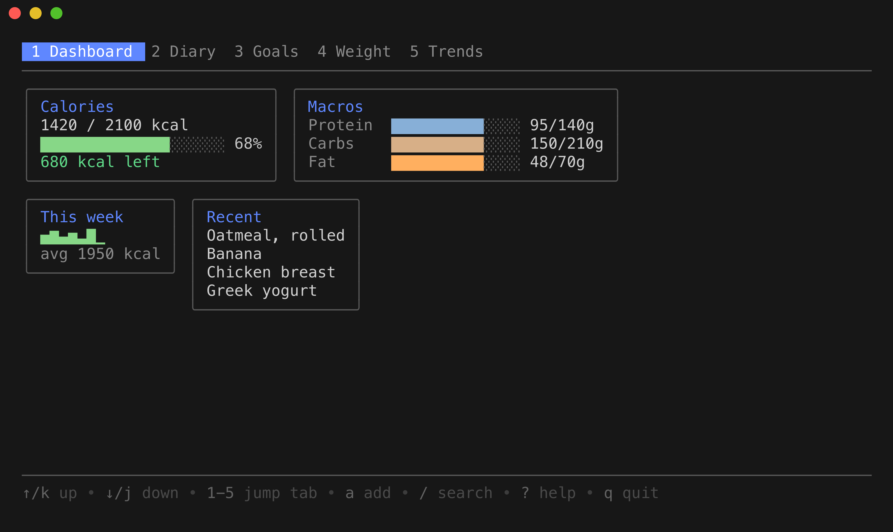
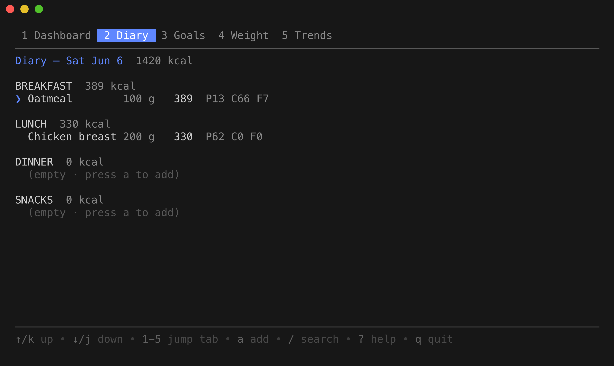
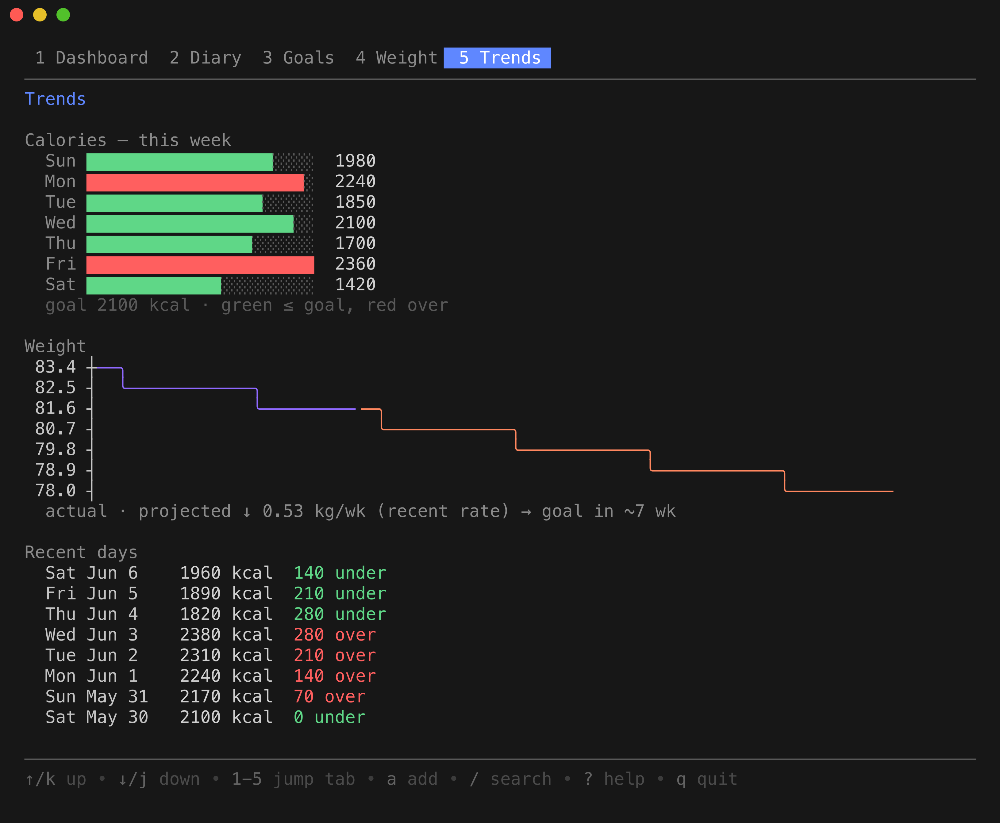
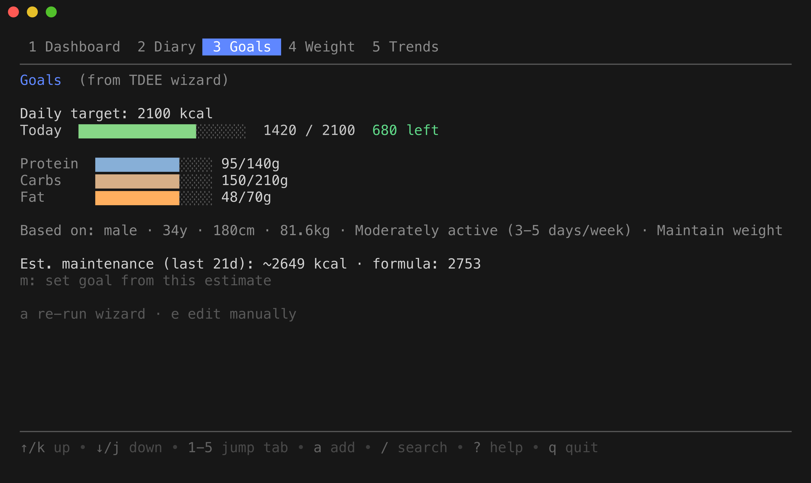
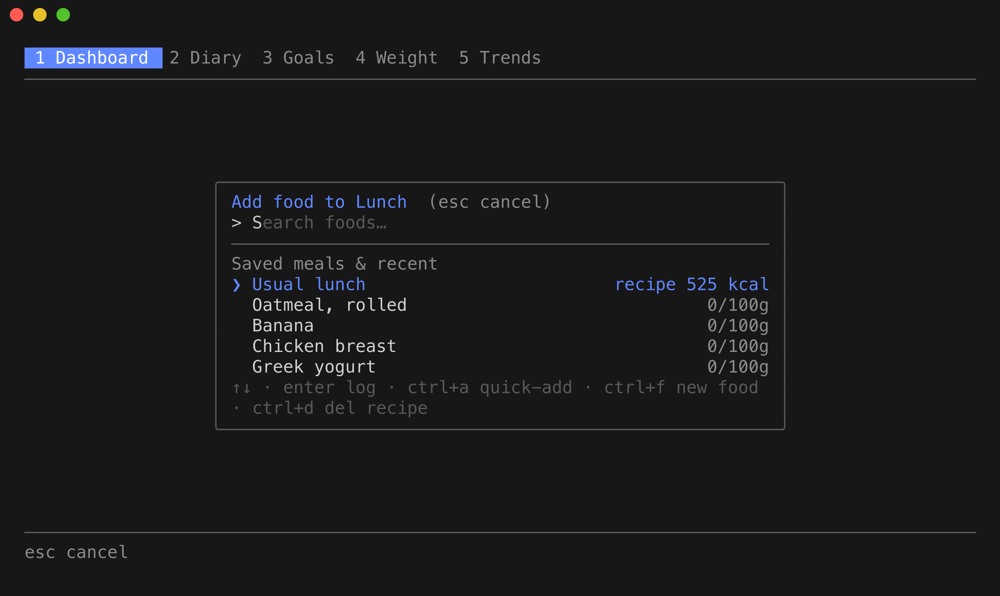

# caltui

MyFitnessPal in a TUI. Offline-first, single-user, local SQLite. Tracks calories
plus protein/carbs/fat, with daily goals, custom foods & saved meals, body-weight
tracking, and history/trend charts. Runs on **macOS, Linux, and Windows**.



## Screens

| Diary — meal-grouped logging | Trends — weekly bars & weight projection |
| :---: | :---: |
|  |  |
| **Goals — TDEE wizard + adaptive maintenance** | **Add food — search, recipes & custom foods** |
|  |  |

> Screenshots are rendered from the real UI (shown in a modern terminal such as
> Windows Terminal, iTerm2, or any xterm-compatible terminal).

## Quick start

Requires Go >= 1.25 (built with 1.26). Pure-Go SQLite — no CGo, Xcode, or C
toolchain needed on any platform.

**macOS / Linux:**

```bash
make build          # -> ./bin/caltui
./bin/caltui        # or: go run ./cmd/caltui
```

**Windows (PowerShell):**

```powershell
go build -o bin\caltui.exe .\cmd\caltui
.\bin\caltui.exe    # or: go run .\cmd\caltui
```

Run caltui in **Windows Terminal** (or any modern terminal) for correct
Unicode/colour rendering. Prebuilt binaries for every platform come from
`make dist` — see [Deployment](#deployment-macos-linux--windows).

First run launches a short setup wizard (a TDEE calculator) that suggests daily
calorie and macro targets you can edit anytime.

## Food data

- **Offline (always available):** a small USDA dataset of common whole foods is
  bundled into the binary for instant search.
- **Online (optional):** branded/packaged items via USDA FoodData Central. Get a
  free API key at <https://fdc.nal.usda.gov/api-key-signup>. Provide it any of
  these ways (highest priority first):
  1. `FDC_API_KEY` environment variable;
  2. a `.env` file in the working directory with `FDC_API_KEY=...` (auto-loaded;
     copy `.env.example`);
  3. `fdc_api_key` in the config file (`~/.config/tuitracker/config.toml`, or
     `%AppData%\tuitracker\config.toml` on Windows).

  Without a key the app runs offline-only.

## Deployment (macOS, Linux & Windows)

caltui is a single static binary with no CGo (pure-Go SQLite), so it
cross-compiles trivially:

```bash
make dist   # -> dist/caltui-{darwin,linux}-{arm64,amd64} and
            #    dist/caltui-windows-{amd64,arm64}.exe
```

Copy the matching binary to the target machine (or `go install ./cmd/caltui`).
The bundled food database and all features work identically on every OS. On
Windows, run the `.exe` from **Windows Terminal** (or any modern terminal) for
correct Unicode/colour rendering. For online lookups, set `FDC_API_KEY` in the
environment or `fdc_api_key` in the config file.

## Keys

- Move: arrows or vim `hjkl` · switch tabs: `1`–`5`, `tab`/`shift+tab`
- `a` add food · `/` search · `e` edit · `d` delete · `y` copy yesterday
- `s` save a meal as a recipe (Diary) · `m` set goal from maintenance estimate (Goals)
- In food search: `ctrl+f` new custom food · `ctrl+a` quick-add · `ctrl+d` delete recipe
- `?` help · `q` quit

These work identically on Windows, macOS, and Linux.

## Data & config location

- macOS / Linux: `~/.config/tuitracker/` (honors `$XDG_CONFIG_HOME`)
- Windows: `%AppData%\tuitracker\` (or `$XDG_CONFIG_HOME` if set)

## Attribution

Food data: U.S. Department of Agriculture, Agricultural Research Service.
FoodData Central. <https://fdc.nal.usda.gov> (public domain, CC0).

## Development

```bash
make test           # go test ./...
make lint           # golangci-lint run
make etl            # rebuild bundled food DB from USDA downloads
make update-golden  # refresh teatest snapshots after intentional UI changes
```
